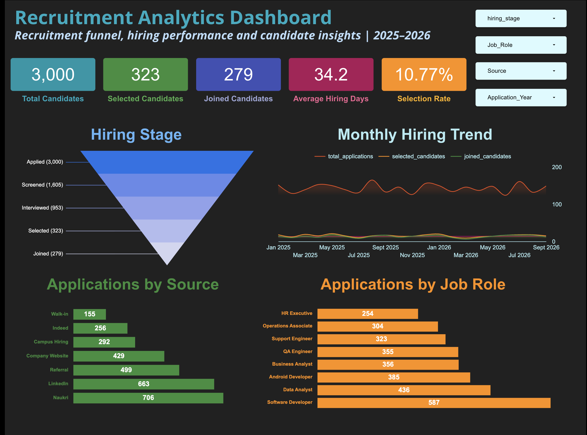

# Recruitment Analytics Dashboard

An end-to-end recruitment analytics project analyzing **3,000 candidate applications** to understand hiring funnel performance, sourcing channels, recruiter performance, candidate patterns, rejection reasons, and hiring timelines.

## Live Dashboard

**[View Recruitment Analytics Dashboard](https://datastudio.google.com/reporting/18751410-e4ae-42d0-91a8-c25c84e32f2d/page/56NAG)**

### Dashboard Preview



The interactive dashboard was created using **Looker Studio** and includes filters for:

* Year
* Job Role
* Source
* Recruiter

## Project Overview

The project simulates a recruitment analytics workflow where candidate application data is cleaned, transformed, analyzed using SQL, and presented through an interactive business dashboard.

### Data Pipeline

**Google Sheets → BigQuery → SQL → Looker Studio**

## Tools & Technologies

* **Google Sheets** — data cleaning and preprocessing
* **Google BigQuery** — cloud data warehouse
* **SQL** — data analysis and KPI calculations
* **Looker Studio** — interactive dashboard and visualization
* **GitHub** — project documentation and version control

## Dataset

The dataset contains **3,000 candidate records** covering recruitment activity from **January 2025 to September 2026**.

Key fields include:

* Candidate ID
* Application Date
* Job Role
* Location
* Experience
* Education
* Source
* Recruiter
* Screening Status
* Interview Status
* Interview Score
* Final Status
* Offer Salary
* Joining Status
* Rejection Reason
* Time to Hire
* Candidate Rating

Additional analytical fields were derived for:

* Application Month
* Application Year
* Experience Band
* Salary Band
* Hiring Stage

## Key KPIs

| KPI                      |      Value |
| ------------------------ | ---------: |
| Total Candidates         |      3,000 |
| Selected Candidates      |        323 |
| Joined Candidates        |        279 |
| Selection Rate           |     10.77% |
| Joining Rate             |      9.30% |
| Average Time to Hire     | 34.23 days |
| Average Interview Score  |      71.56 |
| Average Candidate Rating |       3.74 |

## Analysis Performed

### Recruitment Funnel

Tracked candidates across:

**Applied → Screened → Interviewed → Selected → Joined**

### Source Performance

Compared recruitment sources using:

* Candidate volume
* Screening progression
* Interview progression
* Selection rate
* Joining rate

### Recruiter Performance

Analyzed recruiter-level:

* Candidate volume
* Selection performance

### Job Role Analysis

Compared roles using:

* Application volume
* Selection rate
* Average interview score

### Experience Analysis

Examined selection performance across experience bands.

### Salary Analysis

Analyzed:

* Salary bands
* Average offered salary
* Candidate ratings
* Joining rates

### Rejection Analysis

Identified major rejection categories and their contribution to overall rejections.

### Time-to-Hire Analysis

Analyzed the distribution of hiring timelines for candidates who joined.

### Monthly Hiring Trends

Tracked monthly:

* Applications
* Selected candidates
* Joined candidates
* Selection rate
* Joining rate

## Project Structure

```text
recruitment_analytics_dashboard/
│
├── README.md
│
├── sql/
│   ├── 01_kpi_summary.sql
│   ├── 02_recruitment_funnel.sql
│   ├── 03_source_performance.sql
│   ├── 04_recruiter_performance.sql
│   ├── 05_job_role_performance.sql
│   ├── 06_experience_performance.sql
│   ├── 07_salary_performance.sql
│   ├── 08_time_to_hire_analysis.sql
│   ├── 09_rejection_analysis.sql
│   └── 10_monthly_hiring_trend.sql
│
├── dashboard/
│   └── dashboard_screenshot.png
│
└── data/
    └── README.md
```

## Workflow

### 1. Data Cleaning

The initial recruitment dataset was cleaned and standardized in Google Sheets.

Tasks included:

* Standardizing categorical values
* Checking missing values
* Validating candidate IDs
* Formatting dates
* Standardizing experience and salary bands
* Creating derived recruitment stages

### 2. Data Warehousing

The cleaned dataset was connected to **Google BigQuery** as an external table.

### 3. SQL Analysis

SQL queries were used to create analytical tables for KPIs, recruitment funnel analysis, source performance, recruiter performance, job roles, experience, salary, rejection reasons, time-to-hire, and monthly trends.

### 4. Dashboard Development

The analytical tables were connected to Looker Studio to create an interactive recruitment analytics dashboard.

## Dashboard Pages

### Recruitment Overview

Provides a high-level view of:

* Recruitment KPIs
* Recruitment funnel
* Applications by source
* Applications by job role
* Monthly hiring trends

### Hiring Performance

Focuses on:

* Recruiter performance
* Job-role selection rates
* Experience-based selection rates
* Salary-band joining rates
* Time-to-hire distribution

### Candidate & Rejection Insights

Provides analysis of:

* Rejection reasons
* Rejection share
* Interview scores by job role
* Candidate ratings by salary band

## Key Project Outcomes

This project demonstrates an end-to-end analytics workflow from **raw data preparation to business-facing dashboarding**, with SQL used as the primary analytical layer.

It also demonstrates practical skills in:

* Data cleaning
* Data transformation
* SQL aggregation
* KPI development
* Funnel analysis
* Business analytics
* Data visualization
* Dashboard design

## Future Improvements

Potential extensions include:

* Automated data refresh
* Additional recruitment cost metrics
* Hiring source ROI analysis
* Recruiter workload analysis
* Predictive candidate conversion analysis
* Automated reporting

---

**Author:** Divyam Bansal
